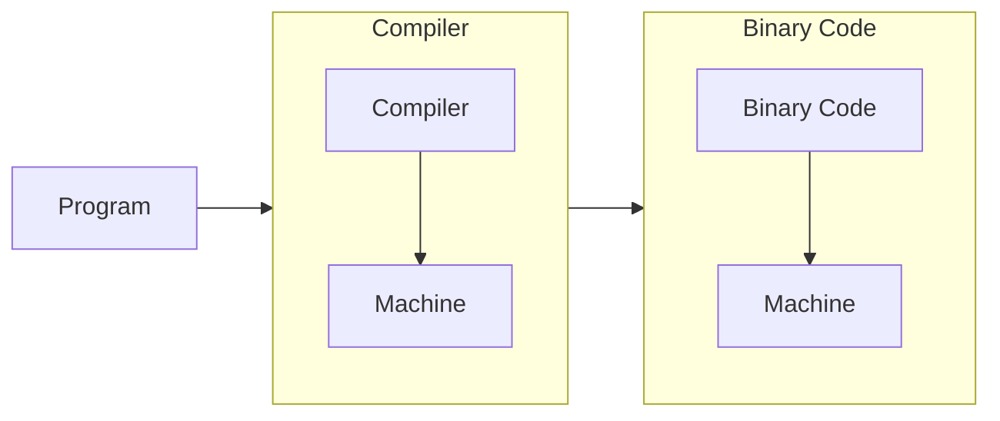
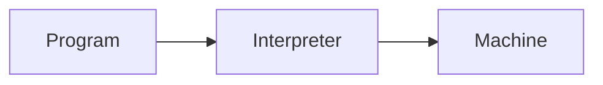

## Language Implementations

将高级的 programming languages 转化为 machine code 主要有两种方法：

- Compilers translate your program
	- "Offline"
	- low-level languages (e.g. C, C++, Rust, Go) 主要使用 compilers

- Interpreters run your program
	- "Online"
	- high-level languages (e.g. Python, Ruby) 主要使用 interpreters

也有一些语言 (e.g. Java, Javascript, WebAssembly) 同时提供了这两种方法：Interpreter + Just in Time (JIT) compiler

## The Structure of a Compiler

1. Lexical Analysis - identify words (syntactic)
	- 将 program text 提取为 "tokens"
	- `if x == y then z = 1 else z = 2` $\to$ `['if', 'x', '==', 'y', 'then', 'z', '=', '1', 'else', 'z', '=', '2']`
2. Parsing - identify sentences (syntactic)
	- 有了 tokens，下一步就是理解 sentence structure
	- Parsing = Diagramming Sentences (a tree)
	- 相当于给你一个 CFG 生成的 string，根据它找出每一步生成的规则得到它的 deriviation 或者说 parsing tree
	- ![[Screenshot 2024-03-13 at 12.52.02.png]]
3. Semantic Analysis - analyze sentences (semantic)
	- 明白了 structure，我们现在需要理解 sentence 具体的含义，不过这对于 compilers 来说太难了，因此 compilers 一般只是进行有限的分析来 catch inconsistencies
4. Optimization - editing
	- 这一步则是直接修改程序，一般进行以下的几种优化：
		- Run faster
		- Use less memory
		- 一般而言是为了节省某些 resources
5. Code Generation - translation
	- 生成 assembly code (compiler) 或者翻译成另一种语言 (interpreter)
	- 过程中可能会生成多次 IR 来逐步发掘高层次抽象中隐藏的 features

相比于以前大部头是 lexical analysis 和 parsing，现在的编译器中最 expensive 的部分是 optimization，其次是 semantic analysis。

## Programming Language Economics

这部分主要回答三个问题：

- Why so many programming languages?
	- 因为 applications 有不同甚至是相互矛盾的需求
- Why new programming languages?
	- 为了填补市场空白
		- 可能是实现用某些已有的语言难以实现的 application
		- 也有可能技术发展得以提高语言设计的质量（主要原因）
	- 另外，新的 PL 并不是 completely new，而是会和一些已有的 PL 很像，甚至算是同一个 family
		- 最主要的原因是 programmer training，其次还有重复造轮子之类的，都是非常 costly 的
	- 还有一个原因就是，已经被广泛使用的 PL 是很难去改变的，从现在很多 PL 的版本更替所导致的众多问题也可以看出来
- What is a good programming language?
	- 这个问题目前没有公认的说法
		- 有一种说法是"A good language is one people use."，这种说法显然（至少我认为显然）是错误的